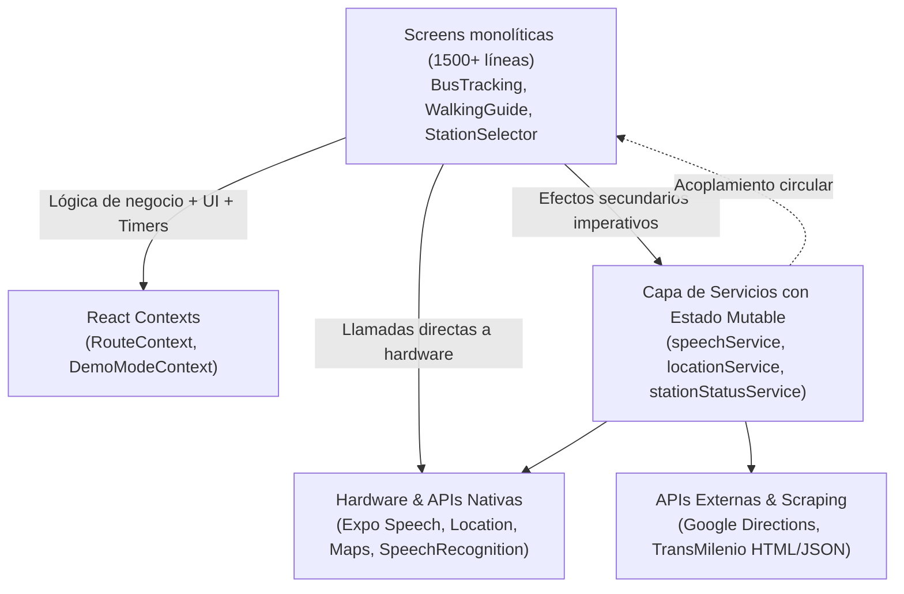
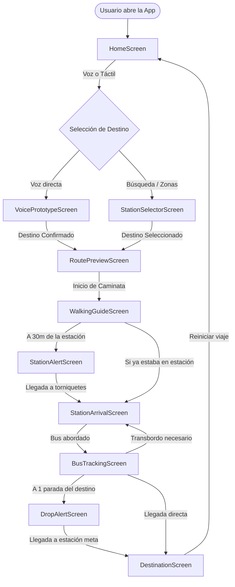
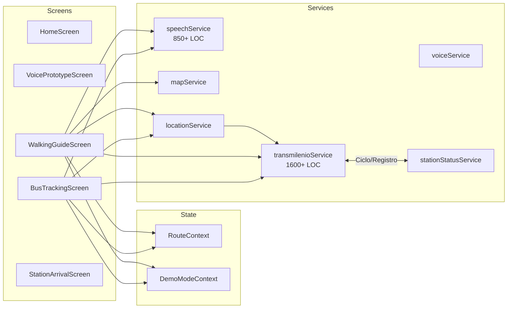
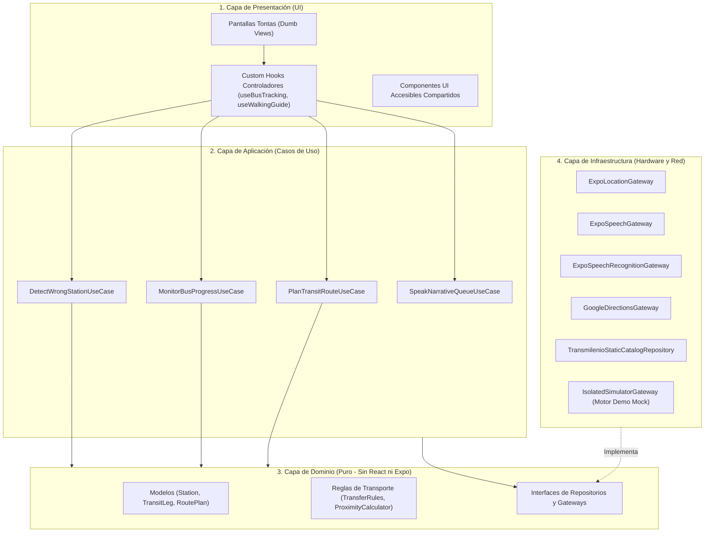

> [!NOTE] Contexto del Documento
> Este documento representa la **auditoría técnica inicial en profundidad** y el **plan de migración modular** de la aplicación **TransmiGuía** (`app-transmi-expo`).
>
> Todas las 5 etapas planificadas en este documento han sido **ejecutadas, validadas y probadas exitosamente**. Para ver el detalle de los archivos modificados, controladores extraídos y la suite de pruebas automatizadas, consulta:
> 👉 **[[resumen_ejecucion_migracion|Resumen de Ejecución de la Migración y Pruebas]]**

# Auditoría de Arquitectura y Plan de Migración — TransmiGuía

> [!NOTE]
> Este documento representa una auditoría técnica en profundidad de la aplicación **TransmiGuía** (`app-transmi-expo`). Se realiza en modo estricto de solo lectura y planificación: **no se ha modificado, creado ni eliminado ningún archivo en el proyecto ni se han instalado dependencias**.

---

## 1. Resumen Ejecutivo del Proyecto

TransmiGuía es una aplicación móvil desarrollada en **React Native (Expo SDK 54, React 19, New Architecture)** orientada a la **accesibilidad total para personas ciegas o con discapacidad visual** en el sistema de transporte público de Bogotá (**TransMilenio**).

Sus pilares funcionales son:
1. **Selección de destino mediante voz** con reconocimiento fonético en español (`expo-speech-recognition`) o interfaz táctil de alto contraste y gran formato.
2. **Guía peatonal guiada por voz y vibración háptica** hacia la estación troncal de origen utilizando Google Directions API y geolocalización continua (`expo-location`).
3. **Alertas de proximidad y abordaje** en estaciones físicas (torniquetes, llegada de buses, validación del código de bus).
4. **Seguimiento en bus en tiempo real** con conteo de paradas, detección de transbordos intermodales (túnel de Ricaurte, corredores de Jiménez/Las Nieves), detección heurística de bajadas en paradas incorrectas (`WRONG_STOP`), detección de pérdida de ruta (`BUS_LOST_ROUTE`), y avisos de descenso.
5. **Modo Demostración / Presentación Autónoma**: un entorno de simulación que sintetiza transcripciones de voz, simula movimiento GPS por coordenadas interpoladas y ejecuta todo el flujo de viaje sin moverse de un escritorio.

---

## 2. Diagnóstico de la Arquitectura Actual

### 2.1 Modelo Arquitectónico Vigente
El proyecto utiliza formalmente un **Monolito en Capas Básicas** (`screens`, `components`, `services`, `hooks`, `context`, `utils`), pero en la práctica implementa el antipatrón **Smart UI / Fat Components (God Screens)** acoplado a **Singletons Imperativos Impuros**:



### 2.2 Principales Características y Deficiencias
1. **Ausencia de Capa de Dominio (Domain Layer)**: No existen entidades de negocio ni casos de uso aislados. Las complejas reglas de transporte (cuándo un usuario se bajó en la estación errónea, cómo se evalúa un transbordo a pie entre plataformas, cuándo se recalcula una ruta) están escritas directamente dentro de ganchos `useEffect` y manejadores de eventos en los archivos `.tsx` de las pantallas.
2. **Fusión Tóxica del Modo Demo y el Modo Real**: En lugar de aislar el modo demo mediante interfaces/estrategias de simulación, **cada pantalla contiene bifurcaciones `if (demoAutoFlowEnabled) ... else ...`**. Esto contamina el código con temporizadores simulados, mocks incrustados en la vista y cientos de `useRef` para evitar carreras entre el mundo real y el simulado.
3. **Singletons con Estado Global Mutable a nivel de Módulo**: Archivos como `speechService.ts`, `locationService.ts`, `stationStatusService.ts`, y `HomeScreen.tsx` contienen variables mutables fuera del ciclo de vida de React (`let speechQueue`, `let isSpeaking`, `let demoTimer`, `let stationStatusMapSnapshot`, `let hasBootstrapped`). Esto genera fallos difíciles de reproducir, desincronizaciones en recarga rápida (Fast Refresh) y memory leaks potenciales.
4. **Acoplamientos Circulares**:
   - `transmilenioService.ts` importa y utiliza `stationStatusService.ts`, mientras ejecuta en tiempo de carga `registerStationCatalog(transmilenioStations)`, vinculando bidireccionalmente el catálogo con el validador de estado.
   - `ScreenContainer.tsx` importa la función de navegación imperativa `navigateToDemoStart` de `AppNavigator.tsx`, el cual a su vez importa las pantallas que envuelven su contenido en `ScreenContainer`.

---

## 3. Inventario y Análisis de Componentes, Módulos y Servicios

### 3.1 Servicios (`src/services/`)
| Archivo | Líneas | Responsabilidad Real | Problemas Identificados |
| :--- | :--- | :--- | :--- |
| `transmilenioService.ts` | 1631 | Catálogo estático de 100+ estaciones con coordenadas GPS, fuzzy search por voz con matriz de ponderación, cálculo Haversine, reglas de transbordo (Ricaurte, Jiménez, Las Nieves), motor de rutas directas y con transferencias. | **Monolito de datos y lógica**. Mezcla persistencia estática, normalización de cadenas, álgebra lineal/geodesia y pathfinding de transporte. |
| `speechService.ts` | 855 | Orquestador de cola de síntesis de voz (TTS) con `expo-speech`, control de interrupciones, control generacional contra carreras, y diccionario de frases predefinidas del sistema. | Cola imperativa manual con `Promise.resolve()`, timeouts de respaldo arbitrarios y mezcla de frases de presentación con lógica de control de audio. |
| `voiceService.ts` | 627 | Wrapper para `expo-speech-recognition`, priorización de paquetes nativos de Android (`com.google.android.tts`, `googlequicksearchbox`), watchdog de silencios, normalización de errores. | Alta complejidad por adaptación a peculiaridades de Android Speech Services. |
| `stationStatusService.ts` | 468 | Verificador de operatividad de estaciones. Soporta JSON remoto, web scraping sobre boletines HTML oficiales de TransMilenio, heurísticas regex locales y caché en disco con `expo-file-system/legacy`. | **Dependencia fantasma**: usa `expo-file-system` que **no está declarado en `package.json`**. Lógica frágil de web scraping HTML regex en tiempo de ejecución. |
| `mapService.ts` | 446 | Cliente HTTP para la API de Google Directions, decodificador de polilíneas geográficas (Haversine), normalizador de instrucciones HTML a lenguaje accesible para personas ciegas. | Mezcla peticiones de red de infraestructura con formateo de accesibilidad de texto para TTS. |
| `locationService.ts` | 275 | Wrapper sobre `expo-location` para tracking GPS en vivo; incluye además un generador de ubicaciones sintéticas con `setInterval` para el modo demo. | Rompe el principio de responsabilidad única al mezclar el sensor GPS real con el simulador de demo. |
| `demoService.ts` | 187 | Lógica de selección del viaje de demostración más representativo (priorizando rutas con transbordos), interpolación de coordenadas de movimiento demo. | Dependiente de ruteos de `transmilenioService`. |
| `permissions.service.ts` | 94 | Consulta y petición de permisos de audio y GPS (`PermissionsAndroid`). | Inconsistencia de nombre de archivo (`permissions.service.ts` vs `camelCaseService.ts`). Lógica atada 100% a Android (`Platform.OS !== 'android'` devuelve `true`). |
| `hapticsService.ts` | 42 | Métodos utilitarios sobre `expo-haptics` (Impactos suaves, medios, fuertes, notificaciones). | Módulo limpio y bien acotado. |

### 3.2 Pantallas (`src/screens/`)
| Pantalla | Líneas | Responsabilidades Acumuladas |
| :--- | :--- | :--- |
| `BusTrackingScreen.tsx` | 1565 | Conteo de paradas, mapa con polilíneas, detección de llegada a estación de transbordo, detección de llegada a destino final, algoritmo de detección de bajada en estación incorrecta (`WRONG_STOP`), algoritmo de desvío (`BUS_LOST_ROUTE`), alertas auditivas, haptic feedback, interpolación demo tick por tick. |
| `WalkingGuideScreen.tsx` | 1242 | Mapa peatonal en vivo, solicitud a Google Directions, recálculo por desvío peatonal (`WALKING_LOST`), detección de pérdida de avance (`stagnant movement`), máquina de estados de proximidad (`far`, `near`, `very_near`, `arrived`), locución paso a paso, simulación demo. |
| `VoicePrototypeScreen.tsx` | 880 | Reconocimiento continuo de voz, simulación de streaming de palabras en demo mediante timeouts, normalización de transcripciones, disambiguación de candidatos, fallback manual con `TextInput`, transiciones de navegación. |
| `StationSelectorScreen.tsx` | 644 | Filtrado por zonas/troncales, búsqueda reactiva por texto, reconocimiento de voz integrado, consulta asíncrona de estaciones cerradas/activas, ordenamiento con chincheta (pin) de la estación activa. |
| `StationArrivalScreen.tsx` | 323 | Secuencia de abordaje, detección de bus simulado vs esperado, botón de "Este no es mi bus", avisos hápticos y de voz de llegada. |
| `RoutePreviewScreen.tsx` | 228 | Resumen de viaje, generación de ruta demo, timeout forzado de avance automático a la caminata peatonal. |
| `DestinationScreen.tsx` | 139 | Pantalla de meta final, felicitación accesible, conteo de paradas totales y reinicio de la pila de navegación. |
| `StationAlertScreen.tsx` | 138 | Transición visual y auditiva cuando el usuario está a menos de 30 metros de la estación peatonal. |
| `DropAlertScreen.tsx` | 131 | Alerta visual y auditiva de 1 parada restante antes de descender del bus. |
| `HomeScreen.tsx` | 128 | Inicialización de permisos, bootstrapping de ubicación, navegación al selector o inicio de demostración. Variable singleton `hasBootstrapped`. |

### 3.3 Contextos y Estado (`src/context/`)
- `RouteContext.tsx`: Gestiona el origen (`TransmilenioStation | null`), destino (`TransmilenioStation`), si ya se seleccionó destino (`hasSelectedDestination`), y estado de fin de recorrido (`tripFinished`).
- `DemoModeContext.tsx`: Orquesta el modo de demostración (`demoModeEnabled`, `demoAutoFlowEnabled`, `demoRunId`, `demoJourney`, `demoState`). `demoState` almacena ubicación simulada, paso actual (`DemoStep`), estación actual, siguiente estación y código de bus.

### 3.4 Utilidades y Hooks
- `src/utils/proximity.ts`: Excelente lógica matemática pura: Haversine, cálculo adaptativo de umbrales según velocidad/precisión y debouncing de alertas de proximidad.
- `src/utils/accessibility.ts`: Llamada asíncrona simple a `AccessibilityInfo.announceForAccessibility`.
- `src/utils/theme.ts`: Paleta de colores de alto contraste (#D0021B rojo TransMilenio, #F6F5F2 fondo suave, textos en alto contraste), espaciados y radios.
- `src/hooks/useLiveLocation.ts` (206 líneas): Hook complejo que unifica tracking real y sintético (demo), monitorea la frescura de la señal GPS (`ok`, `weak`, `stale`, `frozen`) y calcula distancia estacionaria.

---

## 4. Análisis de Dependencias y Estado del Entorno

### 4.1 Dependencias de Producción (`dependencies`)
| Paquete | Versión | Propósito en el Proyecto | Evaluación Técnica |
| :--- | :--- | :--- | :--- |
| `react` / `react-dom` | `19.1.0` | Núcleo de React | Compatible con New Architecture. |
| `react-native` | `0.81.5` | Framework base | Versión moderna con Hermes por defecto. |
| `expo` | `~54.0.33` | SDK de la plataforma | Versión estable y moderna de Expo. |
| `@react-navigation/native` | `^7.1.8` | Núcleo de navegación | React Navigation v7. |
| `@react-navigation/native-stack` | `^7.14.9` | Navegador de pila nativo | Animaciones y rendimiento de transiciones nativas. |
| `expo-location` | `^55.1.4` | Geolocalización GPS | Utilizado para seguimiento peatonal y en bus. |
| `expo-speech` | `~14.0.8` | Síntesis de voz (TTS) | Locución de instrucciones accesibles. |
| `expo-speech-recognition` | `^3.1.2` | Reconocimiento de voz | STT nativo en dispositivo/nube para decir el destino. |
| `expo-haptics` | `~15.0.8` | Motores de vibración | Retroalimentación háptica accesible táctil. |
| `react-native-maps` | `1.20.1` | Mapas de Google en Android | Visualización de rutas, paradas y usuario. |
| `react-native-gesture-handler` | `~2.28.0` | Manejo de gestos táctiles | Requisito de navegación y botones interactivos. |
| `react-native-reanimated` | `~4.1.1` | Animaciones de 60fps | Reanimated 4 para transiciones y animaciones. |
| `react-native-safe-area-context` | `~5.6.0` | Manejo de safe area | Manejo de muescas (notches) e islas dinámicas. |
| `react-native-screens` | `~4.16.0` | Primitivas nativas de pantalla | Rendimiento de memoria para navegación. |
| `react-native-worklets` | `0.5.1` | Motor de hilos de trabajo | Requisito de Reanimated 4. |
| `expo-constants` | `~18.0.13` | Variables de configuración | Lee llaves de Google Maps y URLs en `app.config.ts`. |
| `expo-dev-client` | `~6.0.20` | Cliente de desarrollo local | Necesario para compilar librerías nativas con EAS. |
| `expo-splash-screen` | `~31.0.13` | Pantalla de inicio | Previene flash visual al arrancar la app. |
| `expo-system-ui` | `~6.0.9` | Interfaz de sistema | Ajustes de barra de estado y fondo nativo. |
| `react-native-web` | `~0.21.0` | Soporte web de RN | Permite previsualización web opcional. |
| `eas-cli` | `^18.3.0` | **CLI de Expo EAS** | **Anomalía**: No debe estar en `dependencies` de producción. Añade peso innecesario. Debe ser devDependency o instalarse globalmente. |

### 4.2 Anomalías y Dependencias Fantasma
1. **`expo-file-system` ausente en `package.json`**:
   `src/services/stationStatusService.ts` importa directamente:
   ```ts
   import * as FileSystem from 'expo-file-system/legacy';
   ```
   Sin embargo, `expo-file-system` **no está listado en `package.json`**. Funciona solo si Expo lo arrastra transitivamente, lo cual es frágil y causará fallos en builds limpias de EAS.
2. **Parche huérfano de `@react-native-voice/voice`**:
   En la raíz existe `patches/@react-native-voice+voice+3.2.4.patch`, y `package.json` tiene el script `"postinstall": "patch-package"`. Sin embargo, `@react-native-voice/voice` fue reemplazado por `expo-speech-recognition` y ya no está en `dependencies`. Un `npm install` intentará aplicar el parche a un paquete inexistente.
3. **Triple definición de llaves en `app.config.ts`**:
   `extra` expone `directionsApiKey`, `mapsAndroidApiKey`, `googleMapsApiKey` y `googleMapsAndroidApiKey` de forma redundante para mitigar que distintos servicios buscaban la llave con diferentes nombres.

---

## 5. Diagramas de Flujo y Dependencias

### 5.1 Flujo Funcional de la Aplicación (Viaje Completo)



### 5.2 Mapa de Dependencias Actual (Acoplamiento Cruzado)



---

## 6. Lista Detallada de Problemas Arquitectónicos

### Problema 1: "God Screens" con Responsabilidades Mezcladas
- **Evidencia**: `BusTrackingScreen.tsx` tiene 1565 líneas y 25 `useEffect`/`useRef`. `WalkingGuideScreen.tsx` tiene 1242 líneas.
- **Impacto**: Imposible testear la lógica de transporte sin renderizar la UI completa. Cualquier ajuste en la UI puede romper los cálculos de proximidad o el temporizado del habla.

### Problema 2: Intrusión del Modo Demo en Código Productivo
- **Evidencia**: Ramificaciones constantes en pantallas y hooks:
  ```tsx
  const activeCoordinates = isControlledDemo ? demoState.location : location.coordinates;
  const activeSpeedMps = isControlledDemo ? demoState.location?.speedMps ?? 6 : location.speedMps;
  ```
- **Impacto**: Duplica la superficie de bugs, añade código muerto en producción y ensucia los componentes visuales con timers ficticios.

### Problema 3: Estado Mutable Fuera de React (Module Singletons)
- **Evidencia**:
  - `speechService.ts`: `let speechQueue = Promise.resolve(false); let isSpeaking = false;`
  - `HomeScreen.tsx`: `let hasBootstrapped = false;`
  - `locationService.ts`: `let demoTimer; let demoRoutePoints = [];`
- **Impacto**: Comportamiento impredecible en recargas, fugas de memoria si la app pasa a background y pérdida de determinismo en pruebas.

### Problema 4: Duplicación de Cálculo Geodésico (Haversine)
- **Evidencia**: Se calcula la distancia euclidiana/esférica de forma idéntica e independiente en:
  1. `src/utils/proximity.ts` (`getDistanceInMeters`)
  2. `src/services/transmilenioService.ts` (`calculateDistanceInMeters`)
  3. `src/services/mapService.ts` (`calculateDistanceBetweenCoordinates`)
- **Impacto**: Mantenimiento fragmentado y riesgo de inconsistencia en umbrales de alerta.

### Problema 5: Ausencia de Separación entre Infraestructura y Dominio
- **Evidencia**: `mapService.ts` hace peticiones HTTP a Google y al mismo tiempo traduce textos ("turn right" -> "Gira a la derecha") y formatea instrucciones para ciegos. Si se cambia de proveedor de mapas (e.g. Mapbox u OpenStreetMap), hay que reescribir la lógica de accesibilidad.

---

## 7. Arquitectura Recomendada: Modular por Capas (Clean / Feature-Driven Architecture)

Para una app móvil con requerimientos estrictos de accesibilidad, hardware (GPS, STT, TTS, Háptica) y simulación, se recomienda una **Arquitectura Limpia y Modular (Clean Architecture)** con organización guiada por características (Feature-Driven):



### Por qué esta arquitectura es ideal para TransmiGuía:
1. **Aislamiento Total del Modo Demo**: El modo demo se convierte en una simple implementación mock de `LocationGateway` y `VoiceInputGateway`. Las pantallas y casos de uso no saben si el bus se mueve de verdad o si es una simulación. ¡Se eliminan todas las bifurcaciones `isControlledDemo`!
2. **Testabilidad de Algoritmos Críticos**: Algoritmos como `DetectWrongStation` o `CalculateTransferPlan` pueden testearse con pruebas unitarias en segundos sin mockear React Native ni emuladores.
3. **Estabilidad de Accesibilidad**: La cola de voz se convierte en un caso de uso con prioridades formales (`CRITICAL_ARRIVAL`, `DIRECTION_STEP`, `STATION_INFO`), evitando que los mensajes se interrumpan torpemente.

---

## 8. Estructura de Carpetas Propuesta

```
src/
├── app/                                 # Configuración global de la app
│   ├── config/                          # Variables de entorno y constantes de Expo
│   ├── navigation/                      # Rutas, RootNavigator y tipados de navegación
│   └── theme/                           # Tokens de diseño (colors, typography, spacing)
│
├── core/                                # Utilidades puras compartidas
│   ├── geo/                             # Geo-cálculos puros (Haversine unificado, proyecciones)
│   ├── text/                            # Normalización de acentos, fuzzy scoring fonético
│   └── errors/                          # Clases de error de la aplicación
│
├── domain/                              # Entidades, valores y reglas puras (TypeScript puro)
│   ├── models/                          # Station, TransitLeg, RoutePlan, ProximityState
│   ├── repositories/                    # IStationRepository, IRouteRepository
│   ├── gateways/                        # ILocationGateway, ITTSGateway, ISTTGateway, IDirectionsGateway
│   └── rules/                           # ProximityRules, WrongStopRules, TransferHubRules
│
├── application/                         # Casos de uso de negocio (Use Cases)
│   ├── transit/
│   │   ├── PlanTransitRoute.ts
│   │   ├── CalculateStationProximity.ts
│   │   └── EvaluateBusProgress.ts       # Detección de paradas, wrong-stop, transbordos
│   ├── speech/
│   │   └── AnnounceEvent.ts             # Encolador de anuncios por prioridad
│   └── simulation/                      # Orquestador del viaje sintético demo
│       └── SimulateJourneyPlayback.ts
│
├── infrastructure/                      # Conexión con hardware nativo y APIs
│   ├── hardware/
│   │   ├── ExpoLocationGateway.ts
│   │   ├── ExpoSpeechTTSGateway.ts
│   │   ├── ExpoSpeechRecognitionGateway.ts
│   │   └── ExpoHapticsGateway.ts
│   ├── network/
│   │   ├── GoogleDirectionsGateway.ts
│   │   └── TransmilenioOfficialStatusGateway.ts
│   ├── persistence/
│   │   ├── FileSystemCache.ts
│   │   └── StaticStationCatalog.ts      # Catálogo de estaciones y rutas JSON
│   └── simulation/                      # Implementaciones Mock para Modo Demo
│       ├── MockLocationGateway.ts       # Simula movimiento interpolado
│       └── MockVoiceInputGateway.ts     # Simula transcripciones de voz
│
└── presentation/                        # Capa visual React Native
    ├── components/                      # UI pura reutilizable (AccessibleButton, ScreenContainer)
    │   └── map/                         # MapView agnóstico (solo recibe props de coordenadas)
    ├── hooks/                           # Hooks compartidos (useAccessibilityAnnouncer, etc.)
    └── features/                        # Módulos organizados por pantalla/funcionalidad
        ├── home/
        ├── destination-voice/           # Pantalla de voz + useVoiceDestinationController
        ├── station-selector/            # Pantalla de lista + useStationSelectorController
        ├── walking-guide/               # Pantalla peatonal + useWalkingGuideController
        ├── bus-tracking/                # Pantalla en bus + useBusTrackingController
        └── arrival/                     # Pantallas de llegada a estación y destino final
```

---

## 9. Plan de Migración por Etapas (SIN EJECUTAR)

> [!IMPORTANT]
> Esta propuesta está diseñada para ejecutarse de manera **incremental y no destructiva**. Cada etapa mantiene la aplicación 100% funcional y compilable sin romper la experiencia del usuario.

### Etapa 1: Limpieza de Dependencias y Unificación de Core Matemático
- **Objetivo**: Corregir anomalías de paquetes y unificar la lógica geoespacial.
- **Acciones**:
  1. Mover `eas-cli` a devDependencies.
  2. Instalar explícitamente `expo-file-system` o sustituir el caché por `AsyncStorage` / memoria.
  3. Eliminar el archivo de parche obsoleto `@react-native-voice/voice`.
  4. Crear `src/core/geo/distance.ts` con una única función `calculateHaversineDistance` y reemplazar las 3 implementaciones duplicadas en `proximity.ts`, `mapService.ts` y `transmilenioService.ts`.

### Etapa 2: Extracción del Dominio y Reglas de Negocio Puras
- **Objetivo**: Separar los datos y la lógica algorítmica de los servicios monolíticos.
- **Acciones**:
  1. Extraer los datos crudos de `transmilenioStations` a un archivo de datos puro (`src/infrastructure/persistence/stationsCatalogData.ts`).
  2. Mover los algoritmos de fuzzy matching y normalización fonética a `src/core/text/stationMatcher.ts`.
  3. Mover las reglas de transbordo y pathfinding a `src/domain/rules/transferRules.ts` y `src/application/transit/PlanTransitRoute.ts`.

### Etapa 3: Desacoplamiento de Servicios de Hardware (Gateways)
- **Objetivo**: Envolver APIs de Expo en gateways limpios con interfaces.
- **Acciones**:
  1. Crear `ITTSGateway` y encapsular la cola de habla de `speechService.ts`.
  2. Crear `ILocationGateway` separando el GPS real (`ExpoLocationGateway`) del simulador de demo.
  3. Reorganizar `permissions.service.ts` como `PermissionsGateway` unificado.

### Etapa 4: Extracción de Controladores en Pantallas Críticas
- **Objetivo**: Reducir `BusTrackingScreen` (1565 líneas) y `WalkingGuideScreen` (1242 líneas).
- **Acciones**:
  1. Crear `useWalkingGuideController`: maneja cálculo de paso, desvío peatonal y re-ruteo. La pantalla solo recibe datos a pintar.
  2. Crear `useBusTrackingController`: maneja detección de próxima parada, transbordos, bajada errónea (`wrong-stop`) y avance.

### Etapa 5: Aislamiento del Motor de Simulación Demo
- **Objetivo**: Eliminar el código espagueti de demo de todas las pantallas.
- **Acciones**:
  1. El `DemoModeContext` pasa a ser un proveedor de dependencias: cuando `demoModeEnabled === true`, inyecta `MockLocationGateway` y un orquestador de pasos simulados.
  2. Se limpian todas las bifurcaciones `if (demoAutoFlowEnabled)` de las vistas.

---

## 10. Matriz de Riesgos de la Migración

| Riesgo | Probabilidad | Impacto | Mitigación |
| :--- | :--- | :--- | :--- |
| **Colisión / Silenciamiento de TTS** | Media | Alto | La cola de voz (`speechService`) tiene muchas pausas calibradas (`waitForNarrationPause`). Si se refactoriza descuidadamente, los mensajes pueden superponerse o truncarse. Se debe conservar la cola generacional intacta. |
| **Regresión en Detección de Parada Errónea (`wrong-stop`)** | Baja | Medio | La heurística de `BusTrackingScreen` evalúa precisión GPS < 40m y velocidad < 1.1 m/s. Se deben escribir tests unitarios con los mismos casos de prueba antes de extraer la función. |
| **Fallo en Caché de Estado de Estaciones** | Alta | Medio | `stationStatusService` usa `expo-file-system/legacy`. Si no se añade `expo-file-system` al `package.json`, la app fallará al compilar en producción nativa. |
| **Ruptura de la Accesibilidad (Screen Reader)** | Media | Crítico | Las pantallas tienen `useScreenAnnouncement` y `accessibilityLabel` meticulosos. La reestructuración no debe alterar el orden del árbol semántico para VoiceOver / TalkBack. |

---

## 11. Lista de Archivos Existentes a Modificar Posteriormente

Cuando se apruebe la ejecución de la migración, estos serán los archivos afectados:

1. [`package.json`](../package.json): Mover `eas-cli`, agregar `expo-file-system` si se conserva caché en disco, limpiar scripts de patch.
2. [`src/services/transmilenioService.ts`](../src/services/transmilenioService.ts): Dividir en catálogo de datos, utilidades de texto y algoritmo de búsqueda de ruta.
3. [`src/services/speechService.ts`](../src/services/speechService.ts): Separar el motor de cola (infraestructura) de los mensajes narrativos (aplicación).
4. [`src/services/locationService.ts`](../src/services/locationService.ts): Eliminar la simulación demo interna y dejar únicamente el driver de `expo-location`.
5. [`src/services/stationStatusService.ts`](../src/services/stationStatusService.ts): Resolver importación de FileSystem y desacoplar de `transmilenioService`.
6. [`src/services/permissions.service.ts`](../src/services/permissions.service.ts): Renombrar y estandarizar interfaz multiplataforma.
7. [`src/screens/BusTrackingScreen.tsx`](../src/screens/BusTrackingScreen.tsx): Extraer hooks controladores de seguimiento y desacoplar modo demo.
8. [`src/screens/WalkingGuideScreen.tsx`](../src/screens/WalkingGuideScreen.tsx): Extraer controlador de navegación peatonal y desvíos.
9. [`src/screens/VoicePrototypeScreen.tsx`](../src/screens/VoicePrototypeScreen.tsx): Extraer lógica de reconocimiento y separar la animación de demo.
10. [`src/screens/StationSelectorScreen.tsx`](../src/screens/StationSelectorScreen.tsx): Extraer lógica de filtrado y ordenamiento de estaciones.
11. [`src/screens/HomeScreen.tsx`](../src/screens/HomeScreen.tsx): Eliminar variable singleton `hasBootstrapped` y mover inicio a estado React/Context.
12. [`src/components/ScreenContainer.tsx`](../src/components/ScreenContainer.tsx): Eliminar acoplamiento directo con `AppNavigator` y `stopSpeaking`.
13. [`src/utils/proximity.ts`](../src/utils/proximity.ts): Centralizar la función matemática Haversine.
